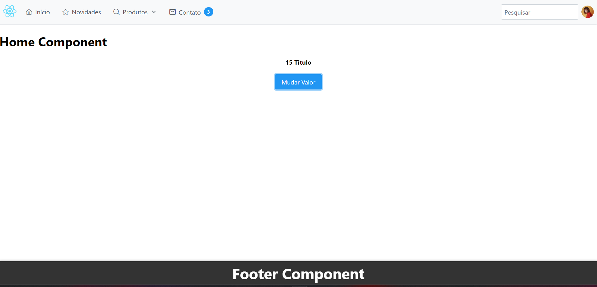

# Projeto React base

## Dependencias para instalar o projeto

- node 18 ou superior
- npm 10.8.2 ou superior

## Dependencias usadas no projeto

- redux
- primereact
- primeflex
- primeicons
- axios
- react-router
- react-router-dom
- sass

## Modo de instalação

- Clone o projeto.

- Acesse a pasta do projeto:

```bash
  cd React-base
```

- Copie o .env.example para .env na raiz do projeto

- Instale as dependências do projeto usando npm

```bash
  npm install
```

- suba o servidor rodando

```bash
  npm run dev
```

Imagens do projeto:


